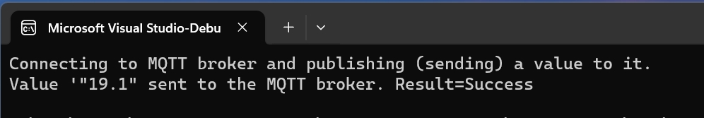
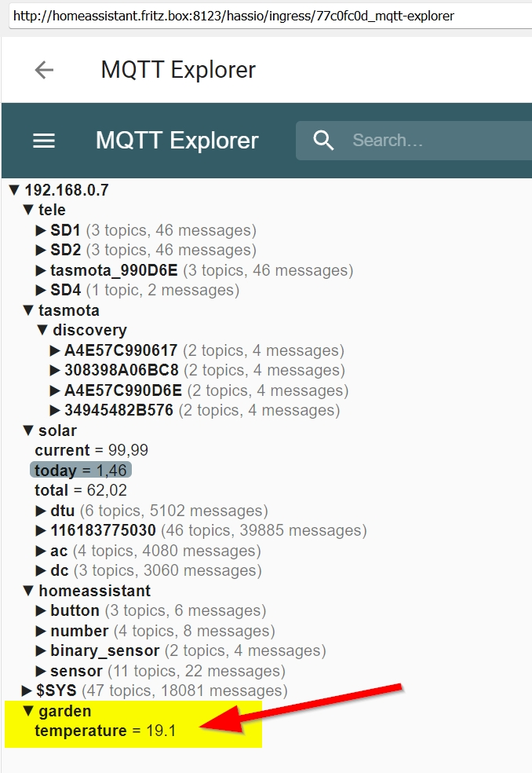
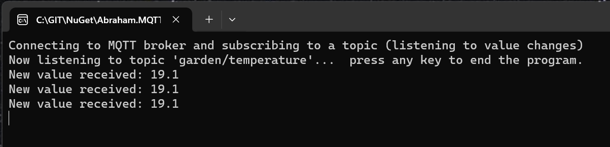

# Abraham.MQTTClient

    


## OVERVIEW

Connects to a MQTT broker, sends and receives topic values.
You can use this Nuget package to read out sensor values, for example to build a custom dashboard.
Please take a look at my demos to find out how to send and receive data.
To use it, you need an MQTT broker, for example Mosquitto (https://mosquitto.org/).
Mosquitto can also be used inside Homeassistant. (https://www.home-assistant.io/).


## LICENSE

Licensed under Apache licence.
https://www.apache.org/licenses/LICENSE-2.0


## Compatibility

The nuget package was build with DotNET 6.


## INSTALLATION

Install the Nuget package "Abraham.MQTTClient" into your application (from https://www.nuget.org).

Add the following code:
```C#
using Abraham.MQTTClient;

var client = new MQTTClient()
    .UseUrl(_url)
    .UseUsername(_username)
    .UsePassword(_password)
    .Build();

var result = client.Publish("garden/temperature", "19.1");
```


That's it!

- _url should be the address of your MQTT broker, for example homeassistant.local, or homeassistant.fritz.box. Omit the port here.
- _username and _password are the values your gave during the installation of mosquitto.
- For more options, please refer to my Demo applications in the github repository (see below).
The Demos and the nuget source code are well documented.


I recommend using Mosquitto as MQTT broker. It's quite easy to install and configure.
You can find it here: https://mosquitto.org/
I'm using it inside Homeassistant. It can be installed as an add-on.
Homeassistant can be found here: https://www.home-assistant.io/


## HOW TO INSTALL A NUGET PACKAGE
This is very simple:
- Start Visual Studio (with NuGet installed) 
- Right-click on your project's References and choose "Manage NuGet Packages..."
- Choose Online category from the left
- Enter the name of the nuget package to the top right search and hit enter
- Choose your package from search results and hit install
- Done!


or from NuGet Command-Line:

    Install-Package Abraham.MQTTClient


## ABOUT THE MQTT API

The API documentation can be found at https://mqtt.org/

I also didn't invent the wheel :-) 
I built my Nuget package on top of the library MQTTnet. It can be found here: https://github.com/dotnet/MQTTnet/tree/master


## AUTHOR

Oliver Abraham, mail@oliver-abraham.de, https://www.oliver-abraham.de

Please feel free to comment and suggest improvements!


## SOURCE CODE

The source code is hosted at:

https://github.com/OliverAbraham/Abraham.MQTTClient

The Nuget Package is hosted at: 

https://www.nuget.org/packages/Abraham.MQTTClient


## SCREENSHOTS

This shows the Producer demo sending a value to topic "garden/temperature":


This shows the Broker in Homeassistant receiving the value:


This shows the Subscriber demo receiving the values (after 2 executions of Publisher demo):



# MAKE A DONATION !

If you find this application useful, buy me a coffee!
I would appreciate a small donation on https://www.buymeacoffee.com/oliverabraham

<a href="https://www.buymeacoffee.com/app/oliverabraham" target="_blank"></a>
